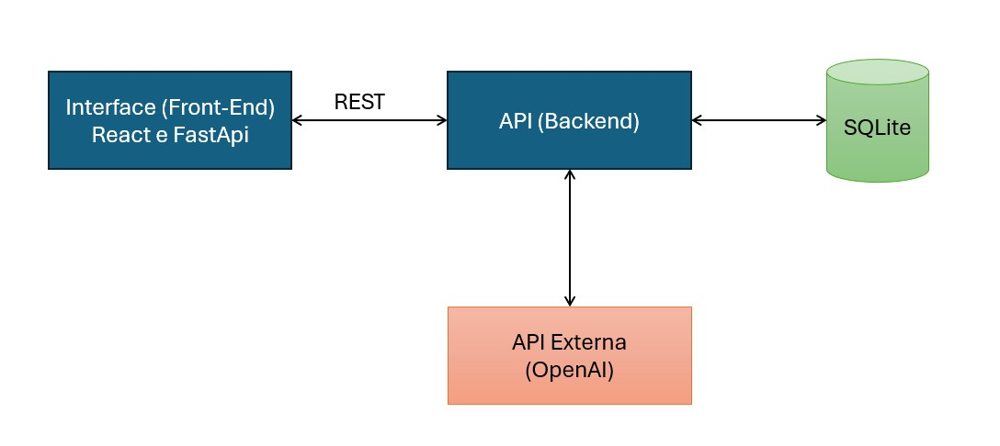

# Sistema de Geração de Testes com IA

Este projeto é um sistema frontend desenvolvido em React para facilitar a criação automatizada de questionários a partir de uma IA. A aplicação se comunica com uma API backend para gerar, exibir e avaliar questões, integrando inteligência artificial ao processo educacional.

## 🎯 Objetivo

Facilitar a criação de questionários personalizados com o apoio de IA, otimizando o tempo de professores e profissionais da educação, e promovendo experiências de aprendizagem adaptativas e modernas.

---

## ✅ Funcionalidades do Sistema

O **SistemaTestesIA** oferece um conjunto de funcionalidades voltadas à geração e gerenciamento de testes com auxílio de Inteligência Artificial. Abaixo estão listadas as principais capacidades do sistema:

- 🔍 **Geração de Testes com IA**  
  Permite ao usuário gerar automaticamente um conjunto de questões com base em um tema definido, utilizando a API da OpenAI.

- 🧠 **Personalização de Parâmetros**  
  O usuário pode configurar:
  - O número de questões desejadas
  - O tipo de questão (múltipla escolha, discursiva ou mista)
  - O nível de dificuldade (fácil, médio ou difícil)

- 📋 **Visualização e Listagem de Testes Criados**  
  Todos os testes gerados são listados para fácil acesso e reutilização.

- 🗑️ **Remoção de Testes**  
  Permite excluir testes que não são mais necessários.

- ✏️ **Avaliação de Respostas**  
  O sistema avalia automaticamente as respostas do usuário às questões de múltipla escolha e fornece um feedback com nota e justificativa.

---

## 🛠️ Tecnologias Utilizadas

- **React** (Frontend)
- **JavaScript**
- **Docker**
- **CSS**
- **OpenAI API** (Integração com IA)
- **Node Package Manager (npm)**

---

## Diagram do Sistema

<p align="center">
  
</p>

---

## 📁 Estrutura do Projeto

```
frontend
├── public/
│   ├── index.html
│   └── ...
├── src/
│   ├── App.js
│   ├── index.js
│   └── ...
├── Dockerfile
├── package.json
└── README.md
```

---

## 🚀 Como Executar o Projeto com Docker Compose

### 1. Preparação da Estrutura

Crie uma pasta localmente e insira nela:

- Os arquivos `docker-compose.yml` e `.env` (fornecidos na entrega do projeto através da plataforma da faculdade).
- Clone este repositório (`SistemaTestesIA-frontend`) dentro da pasta.
- Clone também o repositório do backend (ex: `SistemaTestesIA-backend`).

```
/sua-pasta-projeto
├── .env
├── docker-compose.yml
├── backend/           # Clonado do GitHub
│   └── ...
└── frontend/          # Clonado do GitHub
    └── ...
```

### 2. Executar com Docker Compose

No terminal, dentro da pasta raiz (`meu-projeto`):

```bash
docker-compose up --build
```

A aplicação estará disponível em:

```
Frontend: http://localhost:3000
Backend: http://localhost:8000 (ou a porta definida)
```

---

## 🔄 Principais Endpoints (Frontend)

> A aplicação frontend consome os seguintes endpoints disponibilizados pela API backend:

| Método | Rota                  | Descrição                                |
|--------|-----------------------|-------------------------------------------|
| GET    | `/tests`            | Lista todos os questionários              |
| POST   | `/tests`            | Cria um novo questionário com base na IA  |
| PUT    | `/tests/:id`        | Atualiza um questionário existente        |
| DELETE | `/tests/:id`        | Remove um questionário                    |

---

## 🌐 Integração com API Externa (OpenAI)

A aplicação se integra com a API da OpenAI para gerar as perguntas com base em temas definidos pelo usuário.

### 📌 Informações da API

- **Provedor:** OpenAI
- **Licença:** Proprietária, uso sob assinatura. Forneci a chave com créditos da minha assinatura.
- **Cadastro:** Necessário possuir uma conta em [https://platform.openai.com/](https://platform.openai.com/)
- **Endpoint Utilizado:** `https://api.openai.com/v1/chat/completions`
- **Modelo:** `gpt-4` ou `gpt-3.5-turbo`

---

## 📦 Instalação Local sem Docker (alternativa)

```bash
npm install
npm start
```

A aplicação estará disponível em: [http://localhost:3000](http://localhost:3000)

---

## 👨‍🏫 Autoria

**Autor:** Ricardo Mitrano  
**Data:** Abril de 2025
